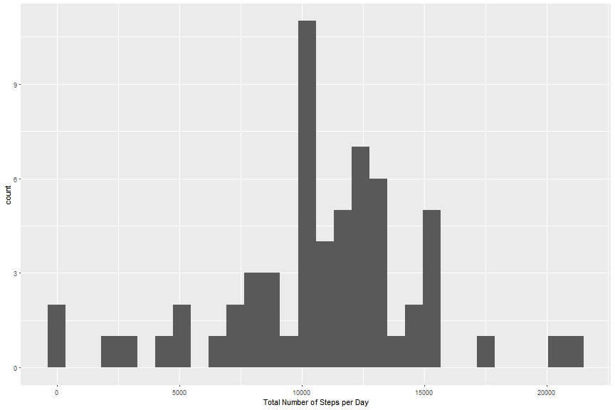

## Loading and preprocessing the data  
Unzip and load the data into memory


```r
setwd("C:/Users/keith_bailey/Documents/GitHub/RepData_PeerAssessment1")
unzip("activity.zip")
activity <- data.table::fread("activity.csv")
```

Cleanup the dates so they show date types in the dataframe  

```r
activity$date <- as.Date(lubridate::fast_strptime(activity$date, format = "%Y-%m-%d"))
```


## What is mean total number of steps taken per day?

```r
# Load required packages
require(dplyr)
require(ggplot2)
require(lubridate)
```


```r
steps_per_day <- activity %>% filter(!is.na(steps)) %>% group_by(date) %>% summarise(total_no_steps_per_day = sum(steps))

steps_per_day
```

```
## # A tibble: 53 × 2
##          date total_no_steps_per_day
##        <date>                  <int>
## 1  2012-10-02                    126
## 2  2012-10-03                  11352
## 3  2012-10-04                  12116
## 4  2012-10-05                  13294
## 5  2012-10-06                  15420
## 6  2012-10-07                  11015
## 7  2012-10-09                  12811
## 8  2012-10-10                   9900
## 9  2012-10-11                  10304
## 10 2012-10-12                  17382
## # ... with 43 more rows
```

###Plot daily step data in histogram and barplot to investigate


```r
# histogram - default number of bins
qplot(steps_per_day$total_no_steps_per_day, geom = "histogram") + labs(x = "Total Number of Steps per Day")
```


The number of bins need some manual work as default too many to be meaningful; I prefer to use a density plot to assess the data


```r
ggplot(steps_per_day, aes(x = total_no_steps_per_day)) + geom_density() + labs(x = "Total Number of Steps per Day")
```


```r
# mean steps taken each day
mean(steps_per_day$total_no_steps_per_day)
```

```
## [1] 10766.19
```

```r
# median steps taken each day
median(steps_per_day$total_no_steps_per_day)
```

```
## [1] 10765
```

## What is the average daily activity pattern?


```r
steps_per_interval <- activity %>% filter(!is.na(steps)) %>% group_by(interval) %>% 
    summarise(mean_per_interval = mean(steps))

plot(x = steps_per_interval$interval, y = steps_per_interval$mean_per_interval, 
    type = "l", xlab = "5 Minute intervals throughout the day", ylab = "Mean Steps Taken per 5 Minute Interval")
```


Which 5-minute interval, on average across all the days in the dataset, contains the maximum number of steps?

```r
steps_per_interval[steps_per_interval$mean_per_interval == max(steps_per_interval$mean_per_interval), 
    ]
```

```
## # A tibble: 1 × 2
##   interval mean_per_interval
##      <int>             <dbl>
## 1      835          206.1698
```


## Imputing missing values

1. Calculate and report the total number of missing values in the dataset (i.e. the total number of rows with NAs)

```r
sum(is.na(activity$steps))
```

```
## [1] 2304
```

```r
# or as a percentage of total observations
paste(round(sum(is.na(activity$steps))/length(activity$steps) * 100, 2), "%", 
    sep = "")
```

```
## [1] "13.11%"
```
2. Devise a strategy for filling in all of the missing values in the dataset. 

We will be using the median values per 5 minute interval & which day of the week to fill in mising values


```r
# add days of week to our data

activity <- activity %>% mutate(day_of_week = wday(date, label = TRUE))

# replace
activity2 <- activity %>% group_by(interval, day_of_week) %>% mutate_each(funs(replace(., 
    which(is.na(.)), mean(., na.rm = TRUE))))
```

### Based on the new data set, repeat our analysis above


```r
steps_per_day2 <- activity2 %>% group_by(date) %>% summarise(total_no_steps_per_day = sum(steps))

steps_per_day2
```

```
## # A tibble: 61 × 2
##          date total_no_steps_per_day
##        <date>                  <dbl>
## 1  2012-10-01               9974.857
## 2  2012-10-02                126.000
## 3  2012-10-03              11352.000
## 4  2012-10-04              12116.000
## 5  2012-10-05              13294.000
## 6  2012-10-06              15420.000
## 7  2012-10-07              11015.000
## 8  2012-10-08               9974.857
## 9  2012-10-09              12811.000
## 10 2012-10-10               9900.000
## # ... with 51 more rows
```

```r
# histogram of the new 'complete' dataset
qplot(steps_per_day2$total_no_steps_per_day, geom = "histogram") + labs(x = "Total Number of Steps per Day")
```



```r
# density
ggplot(steps_per_day2, aes(x = total_no_steps_per_day)) + geom_density() + labs(x = "Total Number of Steps Per Day")
```


```r
# mean steps taken each day
mean(steps_per_day2$total_no_steps_per_day)
```

```
## [1] 10821.21
```

```r
# median steps taken each day
median(steps_per_day2$total_no_steps_per_day)
```

```
## [1] 11015
```
Comparing the original dataset vs the dataset with missing values imputed, we can see minor differences in the mean (original: 1.076619 &times; 10<sup>4</sup>; imputed: 1.082121 &times; 10<sup>4</sup>) and median (original: 1.0765 &times; 10<sup>4</sup>; imputed: 1.1015 &times; 10<sup>4</sup>)

## Are there differences in activity patterns between weekdays and weekends?


```r
# bucket days of the week into two factors; weekend & weekday
activity2$weekend <- chron::is.weekend(activity2$date)
activity2$weekend[activity2$weekend == TRUE] <- "weekend"
activity2$weekend[activity2$weekend == FALSE] <- "weekday"

steps_per_interval_weekends <- activity2 %>% group_by(interval, weekend) %>% 
    summarise(mean_per_interval = mean(steps))

ggplot(steps_per_interval_weekends, aes(x = interval, y = mean_per_interval)) + 
    geom_line() + facet_wrap(~weekend) + labs(x = "Interval periods (5 minute blocks)", 
    y = "Average Number of steps per interval")
```


